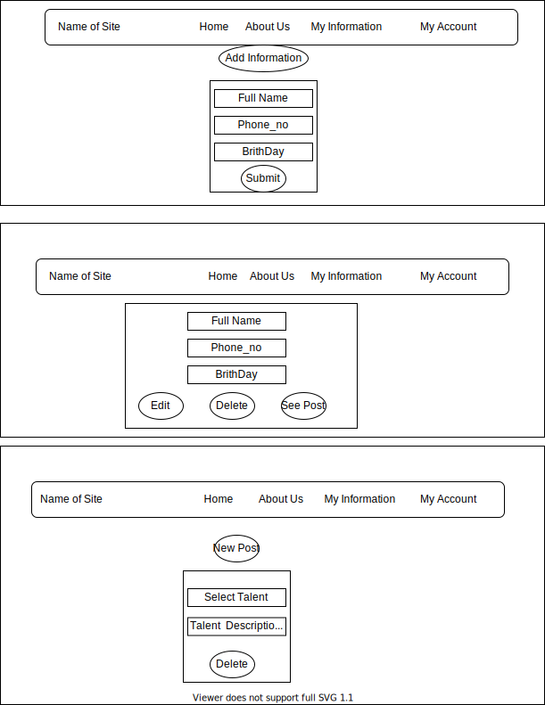
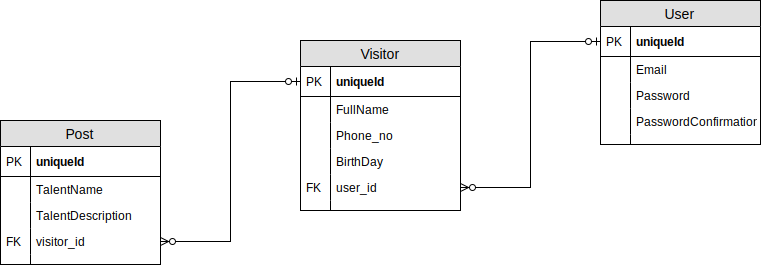

# Project-4-Full-Stack-Application
## Table of Contents
* [Overview](#overview)
* [The Wireframe](#the_wireframe)
* [ER Diagram](#er-diagram)
* [List of technologies ](#list-of-technologies )
* [User Stories](#user-stories)
* [The plan](#the-plan)
* [Future plans](#future-plans)
* [Resources](#resources)

## Overview:
##### Live Application URL [check here](https://warm-citadel-87216.herokuapp.com/users/sign_in)
##### The idea of website :
It is a system that allows every talented person to register via the site (talent support site) and publish his talent after entering his personal information.
 #### The Wireframe:

#### ER Diagram :

#### List of technologies :
***Ruby on Rails*** : A web-application framework that includes everything needed to create database-backed web applications according to the Model-View-Controller (MVC) pattern.

#### User Stories :
##### For User :
- **As  an user** , I should  be able to open account.
- **As  an user**, I should  be able to login.
- **As  an user** ,I should  be able to change my account password .
- **As  an user** ,I should  be able to remove my account .
- **As  an user** ,I should  be able to logout.
##### For Visitor :
- **As  a visitor** , I should  be able to add my information .
- **As  a visitor** , I should  be able to show my information .
- **As  a visitor** , I should  be able to edit my information .
- **As  a visitor** , I should  be able to delete my information .
##### For Post :
- **As  a visitor** , I should  be able to add post .
- **As  a visitor** , I should  be able to show post .
- **As  a visitor** , I should  be able to delete post .

#### future plans :
* Add companies.
* Add admin.
* Improve design .
* Add more features .

### The plan :
##### Personal Development Plan :
1. **My Goals :** Create a website about(talent support site) without error both logical ,and technology.
2. **Objective :** Do all the basic requirement of project.
3. **Resources required :** Keep on training.
4. **Measurement :** Successful .
5. **Deadline :** One week .

#### favorite part :
* I like rails and a specially when create a schema and form, every thing ready.
#### Resources :
- **[Rails Girls Guides](https://guides.railsgirls.com/)**
- **[Rails](https://rubyonrails.org/)**